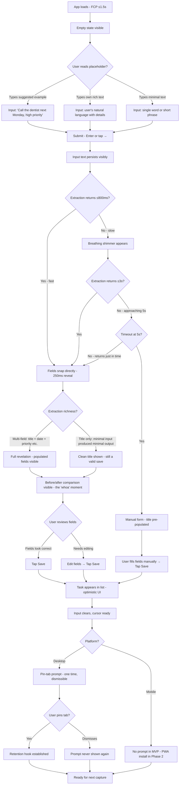
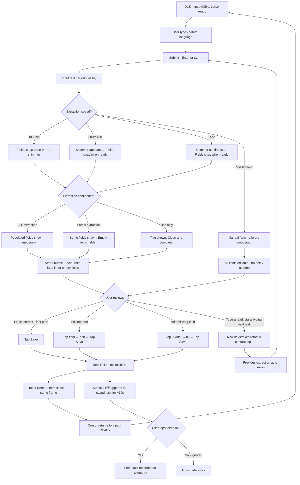
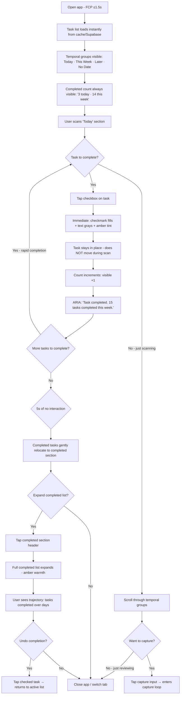
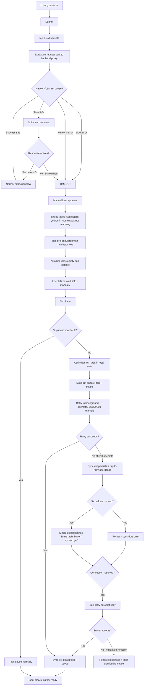

# UX Design Specification — Smart Todo

**Author:** Tomasz
**Date:** 2026-04-13

---

## Executive Summary

### Project Vision

Smart Todo is a thought-capture tool that collapses the gap between thinking of a task and having it recorded. The entire product experience is organized around a single interaction loop: type naturally, see the AI's structured understanding, confirm with one tap. The UX must make this loop feel like an extension of thinking — not an interruption to it. When AI is unavailable, the experience degrades so gracefully that users don't register a difference.

The design language — **Clear + Warm** — is derived from three foundational principles: zero-friction capture, ruthless readability, and completed task emphasis. It rejects both the cold minimalism of productivity tools and the visual noise of feature-heavy competitors. The interface should feel like a well-lit kitchen table where you write your list on a Saturday morning — personal, confident, warm.

The app serves two modes without a toggle: **capture mode** (input-forward, minimal friction, rapid sequential entry) and **review mode** (list-forward, reading focus, morning scan). The design must honor both by making the capture input immediately available without dominating the screen when the user's intent is to read.

### Target Users

**Primary persona — Magda (the overwhelmed multitasker):** A working parent managing family logistics across devices. Captures tasks on her phone while walking, reviews them at her desk. Needs mobile-first instant capture in the thumb zone, natural language date parsing, and a visible completed list that makes her feel lighter. The completed tasks surface is her motivation engine. Critically: the emotional tone must be *satisfaction*, not gamification — she's running a family, not collecting badges.

**Secondary persona — Daniel (the racing-thoughts capturer):** A developer with ADHD where the gap between thought and forgetting is measured in seconds. Needs zero decision points at capture, rapid sequential entry from a pinned tab, and a completed list that serves as *proof* that his system holds. Trust, not motivation, is his emotional driver. The post-save reset must be instant — no success toasts, no animations, just an empty input and a blinking cursor ready for the next thought. The speed of the reset IS the celebration.

**Tertiary persona — Tomasz (the day-15 habitual user):** The creator past the novelty phase. Opens the app in the morning to *scan*, not to capture. Needs the task list front and center during review mode, with the capture input available but not pushy. Values the completed task *count* as quiet daily validation. The threshold for "worth capturing" has permanently lowered.

### Key Design Challenges

1. **Extraction state transition** — The 0-to-3-second journey from raw text to structured form is the product's signature moment. The extraction field reveal is capped at 250ms — a confident snap into place, not a slow unfold. First-time magic comes from the *content* (fields correctly filled), not animation duration. Everything else is instant.
2. **Graceful degradation parity** — The manual form fallback (on 5s timeout or LLM error) must be visually identical to the extraction path. No error states, no second-class experience. Both paths produce the same result.
3. **Completed tasks at scale** — Breaking from the industry default of hiding completions, completed tasks carry full visual citizenship. But 40+ completed items cannot overwhelm active tasks. Solution: **completed count always visible** ("14 tasks completed this week") as the daily emotional signal, with the full completed list expandable on demand for deeper satisfaction.
4. **Responsive input placement** — The capture input lives where your hands and eyes naturally are on each device: **bottom-docked on mobile** (thumb zone, fixed outside scroll flow) and **top-prominent on desktop** (where eyes land on load). The task list scrolls naturally top-to-bottom on both platforms; the input never disrupts that reading flow.
5. **First-use revelation without friction** — The empty state embeds a suggested rich example directly in the capture input as placeholder text ("Try: Call the dentist next Monday, high priority") so the first interaction is focus-and-type, not read-then-type.
6. **Capture vs. review mode** — The app must serve rapid-fire capture (Daniel's standup) and review scanning (Tomasz's coffee) without a mode toggle. The input is *available* without being *dominant* — present in the visual field but not pulling focus when the user's intent is to read.

### Design Opportunities

1. **"Clear + Warm" design language** — Ruthless typographic hierarchy (bold task titles, whisper-weight metadata), purposeful whitespace for rhythm (not aesthetics), and a three-tone color system: neutral for chrome, **hot accent (coral/red-orange) for urgency**, and **earned warm (amber/gold) for the completed state**. Urgency and satisfaction are opposite emotions — their colors feel opposite despite sharing the warm family. Interface teaches itself in 5 seconds.
2. **Completed tasks as visible proof** — The completed count is always present — no tap required. The full list expands on demand, showing items with warm background treatment, a satisfied checkmark, and real presence. They are not the "after" version of active tasks — they are their own surface. The growing count carries different emotional weight for each persona: motivation for Magda, proof for Daniel, comfort for Tomasz. The tone is quiet accumulated satisfaction, never gamification.
3. **Trust through progressive transparency** — The editable extraction form inherently builds trust. The 250ms field-reveal communicates "the AI understood you" with confidence that grows with every correct extraction.
4. **Gravity-anchored capture** — Responsive input placement adapts to device ergonomics: bottom-docked on mobile, top-prominent on desktop. After every save, the input clears instantly and the cursor returns — no toasts, no delays. The tight mechanical cycle of the capture loop is itself the reward for power users.

## Core User Experience

### Defining Experience

Smart Todo's core experience is a five-beat capture loop: **Think → Type → Glance → Tap → Gone.** The entire product exists to make this sequence feel like an extension of thinking — not an interruption to it. Under 10 seconds total, under 5 seconds from extraction display to saved task.

Every other interaction — reviewing tasks, marking completions, organizing into groups — serves the emotional loop that makes capture worth repeating. The app does not compete on task *management* features. It competes on the speed and trustworthiness of the moment a thought becomes a record.

The capture loop has three paths that converge to the same result:
- **Full extraction path:** Type naturally → LLM extracts all fields in ≤3s → review editable form (250ms reveal) → tap save
- **Partial extraction path:** Type naturally → LLM extracts what it's confident about, leaves uncertain fields empty → review form with some fields populated, some blank → fill remaining if desired → tap save
- **Manual path:** Type naturally → 5s timeout or LLM error → manual form appears (title pre-populated) → fill remaining fields → tap save

All three paths feel intentional. None is the "broken" version of another. Partial extraction is the honest state for short or ambiguous inputs — the AI shows what it understood and leaves the rest blank rather than guessing wrong.

### Platform Strategy

Smart Todo is a responsive single-page application serving two distinct physical contexts through one codebase:

**Mobile (phone in one hand):**
- Bottom-docked capture input fixed outside scroll flow (thumb zone ergonomics)
- 44px minimum touch targets on all interactive elements
- 320px minimum viewport support
- Task list scrolls naturally top-to-bottom above the docked input
- Optimized for one-handed, eyes-half-on-screen, capture-under-pressure moments

**Desktop (browser tab, keyboard-first):**
- Top-prominent capture input with auto-focus on page load
- Full keyboard operability — capture-to-save achievable without mouse
- Keyboard shortcut for instant capture focus from anywhere on the page
- Scan-friendly task list with comfortable information density
- Optimized for pinned-tab rapid access during meetings and deep work

**Shared platform constraints:**
- No offline persistence in MVP (Phase 2). Graceful degradation to manual form handles connectivity issues.
- No native mobile apps. Responsive web with PWA installability deferred to Phase 2.
- No push notifications or daily digests in MVP. The pinned browser tab is the only between-session retention mechanism. The first-use experience should explicitly suggest pinning.
- Cross-device session persistence via Supabase — capture on phone, review on desktop.
- FCP ≤1.5s, LCP ≤2.5s, TTI ≤3.0s, CLS ≤0.1. The app must feel ready the instant it loads.

### Effortless Interactions

**Zero-step capture initiation:** The input is already visible and accessible on load — no taps, no scrolls, no menu navigation. On desktop, keyboard focus is automatic. On mobile, the thumb is already on it.

**Natural language as the only input mode:** Users never choose between "AI mode" and "manual mode." They type. The system decides the path (full extraction, partial extraction, or manual fallback) invisibly.

**Honest extraction over guessing:** When the LLM has low confidence in a field (e.g., no date mentioned in the input), that field appears empty — not filled with a guess. A blank field says "I didn't hear a date." A wrong date says "I don't understand you." Partial extraction is a first-class state, not an edge case.

**One-tap save:** After reviewing extracted fields, a single tap saves the task. No confirmation, no "which group?" prompt (ungrouped is the default), no secondary actions required.

**Instant capture reset:** After save, the input clears and the cursor returns in a single frame. No success toasts, no save animations, no delays. The speed of the reset enables rapid sequential capture — three tasks in 45 seconds for power users.

**One-tap completion with visible momentum:** Tap a task to mark it complete. No "are you sure?" dialog. The task moves to the completed surface with quiet visual warmth. The completed count visibly increments — a +1 the eye catches in peripheral vision, even while the user is already typing the next task. Reversible with one tap (unmark complete).

**Ungrouped is the complete default:** Tasks saved without a group assignment live in the main list and the experience is fully functional. Groups are a progressive enhancement for users who want life-domain separation (Work, Family, Personal) — not a prerequisite for using the app. The 3-group limit is communicated upfront when the user first explores groups, not discovered as a wall after investment.

**Temporal readability by default:** The task list is sorted by due date by default, with visual differentiation between temporal zones (due today, due this week, due later, no date). This ensures the list stays useful as it grows — capture speed means nothing if the resulting list is unreadable. Users with 20+ tasks can scan "what matters now" without scrolling through everything.

**Friction eliminated vs. competitors:**

| Competitor Pattern | Smart Todo Pattern |
|---|---|
| Find "add" button → select project → type title → pick date widget → pick priority dropdown → save | Type naturally → glance → tap save |
| Error banner on connectivity failure | Manual form appears, same UI, same result |
| LLM guesses wrong date, user must find and fix it | Uncertain fields left blank — honest, not wrong |
| Completed tasks archived behind toggle | Completed count always visible, full list expandable |
| Mode-switch between input types | One text input handles all fields via extraction |
| Flat list becomes unreadable at 20+ tasks | Temporal visual cues and default due-date sort keep list scannable |

### Critical Success Moments

1. **The First Extraction (first-use revelation):** The user types the suggested example from the placeholder ("Call the dentist next Monday, high priority") and sees title, date, and priority extracted correctly in a 250ms snap. The reaction: "It understood me." This is the make-or-break moment — if the first extraction fails, trust is damaged before it forms. The suggested example is chosen to guarantee multi-field extraction success.

2. **The Pin Prompt (retention hook):** After the first successful capture, the app suggests pinning the browser tab. This is the only between-session retention mechanism in MVP — no push notifications, no daily digests. If the user doesn't pin, the app depends entirely on intrinsic motivation to return. The suggestion must be helpful, not nagging — shown once, dismissible, never repeated.

3. **The Third-Day Return (habit formation signal):** User opens the app on day 3 and sees their task list plus "3 completed today" / "8 completed this week" with warm amber treatment. Temporal framing creates a narrative of progress — "3 today" feels like momentum, "8 total" feels like a database query. This is where novelty transitions to habit.

4. **The Rapid-Fire Dump (power-user stress test):** Three tasks captured in under 45 seconds — type-confirm-type-confirm-type-confirm. Any hitch in the reset cycle (slow clear, toast blocking input, scroll jump) means a lost thought. The capture loop must be a tight mechanical cycle. Short inputs may produce partial extractions — title only, no date, no priority — and that's fine. Honest and fast beats complete and slow.

5. **The Graceful Fallback (trust preservation):** LLM times out at 5 seconds. Manual form slides in with title pre-populated. User saves without registering a problem. If this moment feels "broken," the product's core promise — extraction enhances, never gates — is violated.

6. **The Week-Two List (list hygiene test):** User has 20+ open tasks. The list must still be scannable — temporal grouping surfaces what's due today, default sort keeps recent deadlines visible, the completed count shows trajectory. If the list becomes a wall of undifferentiated text, capture speed has created a write-only database and the user will churn.

### Experience Principles

1. **Capture is sacred.** Every design decision is evaluated against: "Does this make the capture loop faster or more trustworthy?" If the answer is neither, it does not belong in the MVP.

2. **Show, don't gate.** The AI shows its work through editable extracted fields. The manual form shows the same fields empty. Both paths arrive at the same destination. AI enhances, never blocks.

3. **Honest extraction over complete extraction.** The AI should never guess when it doesn't know. Empty fields are an honest answer. Wrong fields are a broken promise. Partial extraction — title populated, other fields blank — is a first-class outcome for short or ambiguous inputs.

4. **Completion has weight.** Finished tasks are not discarded — they accumulate as visible proof of progress. Weight comes from trajectory, not state: the design communicates progress over time ("3 today," "14 this week"), not just accumulated count. The visible +1 increment on completion is the micro-feedback that connects action to progress.

5. **The list must stay useful.** Capture speed means nothing if the resulting list is unreadable. Default due-date sorting, temporal visual cues, and group filtering are not organizational features — they are capture-loop prerequisites. A list of 20+ tasks must remain scannable in under 5 seconds.

6. **The device dictates the posture.** Mobile is one-handed capture under pressure. Desktop is keyboard-first scan-and-capture at a desk. Same product, different physical expressions. Never force one device's interaction model onto the other.

7. **Speed is the feature.** No toasts. No celebrations. No confirmation dialogs. No transition animations beyond the 250ms extraction reveal. The absence of delay IS the product's personality.

## Desired Emotional Response

### Primary Emotional Goals

**Relief at capture (the retention emotion).** The dominant emotion during task entry is the unburdening of a thought. The app absorbs the mental weight — the user doesn't carry it anymore. This isn't the thrill of using a clever tool; it's the quiet relief of setting something down. The faster the capture loop, the quicker the relief arrives. Relief is what brings users back on day 8 when novelty has faded — the memory of a lighter head.

**Surprise at extraction (the acquisition emotion).** The first time the LLM correctly parses "Call the dentist next Monday, high priority" into structured fields, the user feels genuine surprise: "It understood me." This surprise is what users *tell friends about.* "I typed a sentence and it just knew." Unlike relief (which is private), surprise is shareable — it's the story that drives organic word-of-mouth. The surprise fades for the user through repeated use, but it must remain *performable on demand* — every extraction is a potential demo moment when the user shows the app to someone new.

**Accumulated satisfaction from completion (the identity emotion).** Each completed task is a small deposit into a psychological bank account. The emotional reward is not per-task ("good job!") but cumulative ("I'm someone who follows through"). The completed count with temporal framing ("3 today," "14 this week") tells a story of momentum and identity. This is the deepest emotional layer — it connects task completion to self-image.

**Calm presence, never anxiety.** The app must never make the user feel behind, overwhelmed, or guilty. No red "overdue" badges screaming from the tab icon. No aggressive reminders. No guilt-inducing "you missed 5 tasks" banners. The task list is a helpful record, not an authority figure. Tasks without due dates exist peacefully. Tasks due today are visible, not alarming. But calm does not mean silent. The browser tab title shows a simple task count ("3 tasks · Smart Todo") — warm presence, not pressure. The completed trajectory provides positive awareness signals. The goal is *presence without pressure*: the app stays gently visible in the user's world without demanding attention.

### Emotional Journey Mapping

| Moment | Desired Emotion | Anti-Emotion (Avoid) | Design Implication |
|---|---|---|---|
| **First open (new user)** | Curiosity + clarity | Confusion, overwhelm | Empty state with single clear action: the placeholder example invites without demanding |
| **First extraction** | Surprise, "it gets me" | Skepticism, distrust | Suggested example guarantees accurate multi-field extraction on first try. This is the natural emotional peak — let the content carry the magic, not artificial celebration |
| **Rapid capture (Daniel's dump)** | Flow state, unburdening | Impatience, frustration | Instant reset, no interruptions, tight mechanical loop. The speed itself is an emotional peak — a natural high from frictionless productivity |
| **Morning scan (Tomasz's coffee)** | Oriented, in control | Overwhelm, guilt | Temporal sorting surfaces what matters today; no "overdue" guilt signals |
| **Marking complete** | Quiet satisfaction, +1 momentum | Emptiness, "so what?" | Visible count increment, warm visual treatment, temporal framing |
| **Seeing completed count** | Pride in trajectory, identity | Indifference | "3 today" / "14 this week" — the narrative of a person who follows through |
| **Extraction fails (timeout)** | Unbroken confidence | Betrayal, frustration | Manual form appears seamlessly, title pre-populated, no error language |
| **Extraction partially works** | Acceptance, honesty | Annoyance at wrong guesses | Blank fields for uncertain data; honest gaps over confident errors |
| **List grows to 20+ items** | Still in control, scannable | Drowning, "this isn't working" | Temporal zones, due-date sort, group filtering keep the list parsable |
| **Returning after 3 days away** | Welcome back, continuity | Guilt, "I abandoned it" | No guilt signals. Tasks are where they left them. Completed count reminds of past progress. |
| **The demo moment** | Accessible surprise, shareability | Embarrassment, "it doesn't always work" | The extraction must be *performable* — when a user types a rich sentence to show a friend, the fields snap into place and the friend says "whoa." The suggested example from the placeholder is always available as a reliable demo input. |
| **Opening app for the 50th time** | Invisible friction, warm utility | Boredom, "is this all?" | The product disappears from friction, not from awareness. The capture loop is muscle memory. The completed count keeps the product present through positive signals. |

### Micro-Emotions

**Confidence vs. Confusion:** The interface must communicate its affordances instantly. The capture input, task list, and completed section should be the only three elements competing for attention. A new user should understand the entire product in 5 seconds. Confidence grows from simplicity, not from tutorials.

**Trust vs. Skepticism:** Trust is built through the extraction's honesty — showing what it knows, admitting what it doesn't (empty fields), and being right often enough that the user stops checking. The editable form is the trust mechanism: it says "here's my understanding, you have final say." Trust is also repaired quickly — one wrong extraction doesn't erode weeks of accuracy if the correction is easy (one tap to clear a field).

**Satisfaction vs. Emptiness:** The completion micro-animation (count incrementing, warm treatment appearing) must be *just enough* to register without interrupting flow. Too much celebration feels patronizing. Too little makes completion feel like deletion. The +1 count increment is the emotional sweet spot — peripheral, visible, momentum-building.

**Calm vs. Anxiety:** This is the emotional floor — the app must never drop below calm. No red badges, no overdue counts in the tab title, no "you have X tasks waiting." The warm color palette reinforces this: amber and gold for completions, coral only for user-set high priority (not system-generated urgency). The system never generates urgency; only the user does.

**Presence vs. Absence:** The app must avoid *both* extremes — nagging presence (notifications, badges, guilt) and complete silence (no recall mechanism, invisible between sessions). The middle ground is *warm presence*: the tab title shows a task count, the completed trajectory provides positive awareness, the warm visual tone says "I'm here when you need me." The user is gently aware the app exists without feeling demanded upon.

### Design Implications

| Emotional Goal | UX Design Choice |
|---|---|
| Relief at capture | Zero-step input access, instant save, immediate reset. The fewer micro-decisions between thought and record, the greater the relief. |
| Surprise at extraction (performable) | 250ms extraction reveal — confident, not theatrical. Suggested placeholder example always available as a reliable demo input. The extraction moment is the product's "show-and-tell" asset. |
| Trust deepening into background | Honest partial extraction. Editable fields. No "AI mode" labeling beyond the required transparency indicator. Trust is measured by the *absence* of doubt, not the presence of reassurance. |
| Accumulated satisfaction | Completed count with temporal framing always visible. Warm amber background on completed items. +1 increment animation visible in periphery. |
| Calm presence, not silence | Browser tab title shows task count ("3 tasks · Smart Todo"). No red badges, no overdue alerts. Warm presence: visible, not demanding. |
| Natural peaks, no artificial spikes | The first extraction and rapid-fire capture flow are natural emotional peaks — let the product's speed and accuracy carry them. No confetti, no sounds, no badges, no "streak" counters. The product celebrates through performance, not decoration. |
| Curiosity at first open | Empty state with embedded placeholder example. Single clear action. No feature tour, no onboarding carousel. The product teaches through doing. |
| Flow state in rapid capture | No toasts, no modals, no interruptions. Input resets in one frame. Cursor returns automatically. The loop is tight enough to enter flow. |
| Control during morning scan | Temporal sorting (today / this week / later / no date). Group filtering. Comfortable information density on desktop. The list reads itself. |
| Continuity on return | Session persists across closes. Tasks appear instantly (FCP ≤1.5s). No "loading" state that implies disconnection. No guilt signals. Completed count reminds of past momentum. |
| Demonstrability | The extraction moment stays accessible for showing others. Every capture is a potential demo. The product's core value is visible in a single interaction. |

### Emotional Design Principles

1. **Relief is the retention engine.** Smart Todo removes thoughts from your head and puts them somewhere safe. The emotional core is unburdening. Every design choice should amplify the feeling of "it's out of my head now." Relief is private, cumulative, and what brings users back after the novelty fades.

2. **Surprise is the acquisition engine.** The extraction moment — "I typed a sentence and it just knew" — is the story users tell friends. This surprise must remain performable on demand even after the user personally stops feeling it. Every extraction is a potential demo. Surprise drives word-of-mouth; relief drives retention. Both are primary emotions serving different success metrics.

3. **Satisfaction accumulates as the baseline, with natural peaks.** Per-task artificial celebration (confetti, sounds, badges) is forbidden. But natural emotional peaks — the first extraction's "whoa," the rapid-fire dump's flow state — are part of the product's character and should not be suppressed. Satisfaction grows from the gentle upward slope of "3 today" / "14 this week." Natural peaks punctuate it.

4. **Calm is the emotional floor; warm presence is the steady state.** The app must never make the user feel worse than when they opened it. No guilt, no system-generated urgency, no "you're behind" signals. But calm does not mean silent. The tab title task count, the completed trajectory, and the warm visual tone maintain gentle awareness. The goal is presence without pressure — the app stays in the user's world without demanding attention.

5. **The product disappears from friction, not from awareness.** By week 3, the capture loop is muscle memory and the extraction is expected. The product vanishes from *conscious effort* — but the completed count, temporal framing, and tab presence keep it in *positive awareness.* The user doesn't think about the tool. They think about their tasks. But when asked "how do you like it?" they can point to the count and say: "14 this week. It works."

## UX Pattern Analysis & Inspiration

### Inspiring Products Analysis

The guiding inspiration principle for Smart Todo is: **speed and visual clarity communicate respect for the user's time.** Every pattern borrowed or adapted must pass this test. The following products are analyzed not as competitors but as UX reference points — each excels at a specific challenge Smart Todo faces.

**1. Linear (project management tool)**

Linear is the gold standard for "speed as personality." Every action is instant. Transitions are 100-150ms. The UI never shows a spinner where an optimistic update can serve. The visual design is restrained, but the *information density* is remarkably high without feeling cluttered. Linear proves that density and clarity are not opposites when typography and spacing do their job.

**What Smart Todo borrows:**
- *Optimistic UI everywhere.* Task appears in list instantly on save; Supabase write happens in the background. On failure: 3 retries with exponential backoff, then a subtle "not yet synced" dot indicator — never an error toast.
- *Sub-100ms transition standard.* All interactions except the extraction reveal feel instantaneous. Compositable CSS properties only (`opacity`, `transform`, `background-color`) — never animate `width`, `height`, `top`, `left`, or `margin` to avoid layout recalculation jank on mid-range phones.
- *Information density via typography hierarchy.* Task title at full weight, metadata beneath at lighter weight, separated by rhythm rather than boxes or borders.

**What Smart Todo doesn't borrow:** Linear's dark-mode-default aesthetic (conflicts with "Clear + Warm") and its team-scale complexity.

**2. iA Writer (writing app)**

iA Writer embodies "the content is the interface." The app is essentially a blank page with a blinking cursor. The typeface is the product's signature — it makes the act of typing feel considered. The philosophy: remove everything that isn't the writing.

**What Smart Todo borrows:**
- *The input IS the product.* The capture input should feel like iA Writer's blank page — an invitation, not a form.
- *Typography as the primary design element.* Inter as a self-hosted variable font (~100KB), loaded with `font-display: optional` to prevent flash of unstyled text. If Inter doesn't load within ~100ms, the system font stays for that page load — no layout shift. On subsequent loads, Inter is cached and loads instantly.
- *The empty state as confident invitation.* No apologetic "you have no tasks yet!" — just the input, the placeholder, the possibility.

**What Smart Todo doesn't borrow:** iA Writer's monastic austerity (Smart Todo needs warmer emotional tones) and its single-mode interface.

**3. Apple Reminders (iOS/macOS, post-2023 redesign)**

Apple Reminders nails completion micro-feedback and temporal grouping. The completion animation is exactly the right amount of ceremony: enough to register as "done," not enough to interrupt flow.

**What Smart Todo borrows:**
- *Completion micro-feedback calibration (~300ms).* Checkmark fill + amber background shift + count increment — CSS keyframes on compositable properties. Enough to register, not enough to interrupt the next capture.
- *Temporal grouping as native structure.* "Today / This Week / Later / No Date" as client-side partition on the task array. Lightweight sticky section headers with zone labels ("Today · 3 tasks") — the list feels like one continuous surface with gentle landmarks, not four separate lists.

**What Smart Todo doesn't borrow:** Apple Reminders' visual blandness and deep feature set.

**4. WhatsApp / iMessage (messaging apps)**

The single best reference point for Smart Todo's capture loop rhythm. The send → clear → ready cycle is the tightest interaction loop in consumer software.

**What Smart Todo borrows:**
- *The send → clear → ready rhythm.* Type → save → input clears → cursor blinks → ready for next. Users already know this rhythm from thousands of daily messages.
- *Bottom-docked mobile input.* The most validated mobile input placement pattern in the world. Implementation via CSS Grid with named areas — same DOM, different visual position on mobile vs. desktop. Virtual keyboard interaction on iOS Safari requires dedicated testing (budget 1 day): `visualViewport.resize` events or CSS `env(keyboard-inset-bottom)` to keep input above the keyboard.
- *Always-ready, never-modal input.* No mode switching to start typing.

**What Smart Todo doesn't borrow:** The conversational metaphor. The extraction review form has no messaging equivalent.

### Transferable UX Patterns

| Pattern | Source | Application in Smart Todo | Implementation Notes |
|---|---|---|---|
| **Optimistic UI** | Linear | Task appears in list instantly on save; Supabase write is background | Standard pattern. 3 retries + subtle sync dot on failure. Low effort. |
| **Sub-100ms transitions** | Linear | All interactions except extraction reveal feel instantaneous | Compositable CSS properties only. Low effort, low risk. |
| **Extraction form reveal (250ms)** | Smart Todo original | Fields snap into place after extraction returns | Reserve form space with subtle "breathing" shimmer during 0-3s wait to prevent CLS. Shimmer is barely noticeable; the field snap is the moment. |
| **Typography-as-architecture** | iA Writer | Inter variable font, dramatic weight hierarchy, no decorative borders | Self-host Inter (~100KB), font-display: optional. Trivial effort. |
| **Empty state as invitation** | iA Writer | Placeholder text in capture input; confident absence, not apology | No technical complexity. |
| **Completion micro-feedback (300ms)** | Apple Reminders | Checkmark fill + amber shift + count increment | CSS keyframes on compositable properties. Low effort. |
| **Temporal grouping** | Apple Reminders | Due today / this week / later / no date as lightweight sticky section headers | Client-side JS partition on task array. Trivial effort. |
| **Send → clear → ready rhythm** | WhatsApp | Save clears input, returns cursor, ready for next task in one frame | Synchronous local state update. Trivial effort. |
| **Bottom-docked mobile input** | WhatsApp | Capture input fixed at bottom of viewport on mobile, top on desktop | CSS Grid for responsive placement. Budget 1 day for iOS Safari keyboard testing. Medium effort. |
| **Always-ready input** | WhatsApp | Input always visible and accepting text, never behind a tap | No technical complexity. |
| **Tab title task count** | Smart Todo original | "3 tasks · Smart Todo" in browser tab | One line of code. Trivial effort. |

### Anti-Patterns to Avoid

| Anti-Pattern | Seen In | Why It Fails for Smart Todo |
|---|---|---|
| **Overdue task guilt** | Todoist (red overdue count), TickTick (badges) | Violates "calm is the emotional floor." System-generated urgency creates anxiety, not action. |
| **Feature-tour onboarding** | Most SaaS products (carousels, tooltips) | Violates "the product teaches through doing." The first extraction IS the onboarding. A tour delays the magic moment. |
| **Save confirmation toasts** | Most CRUD apps ("Task saved!") | Violates "speed is the feature." A toast that takes 2 seconds to dismiss is 2 seconds stolen from the next capture. |
| **Celebration animations on completion** | Habitica (XP), Todoist (karma) | Violates "satisfaction accumulates, never spikes." Artificial celebration feels patronizing for a personal utility. |
| **Hidden input behind FAB/button** | Google Tasks, many mobile apps | Violates "zero-step capture initiation." Every tap between thought and typing is a decision point where users lose the thread. |
| **Calendar widget for date entry** | Most task apps (date picker popup) | Violates extraction-first model. User already said "next Monday." Show as editable text field, not a picker, unless user explicitly taps to change. |
| **Separate "AI mode"** | Products that label AI as "beta" or toggle | Violates "show, don't gate." The AI is the default path. Only indicator: required "Powered by AI" transparency label. |
| **Aggressive empty states** | Apps with "Get started!" + exclamation marks | Violates calm presence. The empty state should feel like a blank notebook page — ready, not insistent. |
| **Layout-trigger animations** | Common web anti-pattern | Animating `width`, `height`, `margin` causes layout recalculation. Use `transform` and `opacity` only for 60fps on mobile. |
| **Skeleton screens with obvious placeholders** | Standard loading pattern | During extraction wait, use a subtle "breathing" shimmer — barely noticeable — not obvious placeholder bars that scream "loading." The form is preparing itself, not asking you to wait. |

### Design Inspiration Strategy

**Adopt directly:**
- WhatsApp's send → clear → ready input rhythm as the capture loop benchmark
- WhatsApp/iMessage's bottom-docked mobile input placement (via CSS Grid + viewport keyboard handling)
- Linear's optimistic UI pattern (instant visual feedback, background persistence, retry on failure)
- Apple Reminders' completion micro-feedback calibration (~300ms, compositable CSS only)
- Apple Reminders' temporal grouping model (today / this week / later / no date)

**Adapt for Smart Todo's context:**
- iA Writer's "content is the interface" philosophy — adapt from monastic writing tool to warm productivity tool by adding three-tone color system and temporal framing
- Linear's information density — adapt from team project tool to personal task list by reducing density and increasing whitespace for "warm, not corporate" tone
- Linear's transition speed standard — sub-100ms for all interactions except the 250ms extraction reveal (the one permitted ceremony)

**Reject explicitly:**
- Todoist's urgency-based engagement model (overdue badges, streak mechanics)
- Any onboarding that delays the first extraction moment
- Any post-save feedback that interrupts the capture loop
- Any completion celebration that exceeds the 300ms micro-feedback window
- Any input placement that requires a tap to activate on mobile
- Any animation that triggers layout recalculation (non-compositable properties)

### Technical Feasibility Summary

| Pattern | Feasibility | Effort | Risk |
|---|---|---|---|
| Optimistic UI | Easy | Low | Low — standard pattern with retry mechanism |
| Sub-100ms transitions | Easy | Low | Low — compositable properties only |
| Bottom-docked mobile input | Medium | Medium | Medium — iOS Safari keyboard interaction needs dedicated testing day |
| Typography (Inter variable font) | Trivial | Trivial | None — self-host, font-display: optional |
| Temporal grouping | Easy | Low | None — client-side partition with sticky headers |
| Tab title task count | Trivial | Trivial | None — one line of code |
| Completion micro-feedback | Easy | Low | None — CSS keyframes |
| Extraction form reveal | Easy | Low | Low — shimmer placeholder during wait, snap on return, reserve space for CLS prevention |

All borrowed patterns are technically feasible within the MVP timeline. The bottom-docked mobile input is the only pattern requiring dedicated testing effort. No architectural red flags.

## Design System Foundation

### Design System Choice

**Tailwind CSS + Headless Accessible Component Primitives**

A utility-first CSS framework providing total visual control and design token management, combined with headless (unstyled) component primitives that deliver WCAG 2.1 AA accessible behavior without visual opinions. The "Clear + Warm" design language is expressed entirely through Tailwind configuration and utility classes. Accessible interactions (keyboard navigation, focus management, ARIA announcements) are provided by headless component libraries matched to the SPA framework chosen in the architecture phase.

### Rationale for Selection

| Decision Factor | Why This Approach Wins |
|---|---|
| **Custom design language** | "Clear + Warm" can't be achieved by theming MUI or Chakra — it requires total visual control. Tailwind's utility classes build the design language directly, not by overriding defaults. |
| **Solo developer timeline** | A full custom system would consume weeks on accessible primitives. Headless libraries provide correct keyboard/focus/ARIA behavior out of the box — the hardest part of WCAG compliance delivered free. |
| **WCAG 2.1 AA compliance** | Headless primitives (Radix, Melt, Headless UI) are purpose-built for accessibility. Focus trapping, arrow-key navigation, live region announcements, and screen reader compatibility come standard. |
| **Bundle performance** | Tailwind purges unused CSS (~10-25KB gzipped). Headless primitives are 2-5KB per component. Total design system overhead: ~30-40KB gzipped. Compared to MUI (~80-100KB) or Chakra (~60-80KB), this preserves the performance budget for the product. |
| **Framework flexibility** | The architecture phase hasn't selected the SPA framework yet. Tailwind is framework-agnostic. Headless primitive libraries exist for every major framework: Radix UI (React), Melt UI (Svelte), Headless UI (React/Vue), Ark UI (framework-agnostic). The design system choice doesn't lock the framework decision. |
| **Small component surface** | Smart Todo needs ~10 UI components total (input, form fields, button, task item, checkbox, collapsible section, section header, loading shimmer, badge/indicator, tooltip). This is too small to justify a full component library's weight and too important to build without accessibility primitives. |

### Implementation Approach

**Design Tokens (via `tailwind.config`):**

```
Colors:
  neutral:    warm grays (background, borders, secondary text)
  coral:      hot accent (user-set high priority, urgency signals)
  amber:      earned warm (completed tasks, satisfaction signals)
  primary:    dark warm gray (task titles, primary text)
  surface:    off-white / warm white (page background)

Typography:
  font-family: Inter (variable, self-hosted, font-display: optional)
  scale:       task-title (bold, 16-18px), metadata (light, 13-14px),
               section-header (medium, 12-13px uppercase), count (semibold, 14px)

Spacing:
  rhythm:     4px base unit. Task items at 12-16px vertical padding.
              Section gaps at 24-32px. Input area at 16px padding.

Transitions:
  fast:       80ms (hover states, button press)
  standard:   100ms (task completion, input clear)
  reveal:     250ms (extraction form fields appearing)
  feedback:   300ms (completion micro-animation)

Breakpoints:
  mobile:     ≤768px (bottom-docked input, touch-optimized)
  tablet:     769-1024px (transitional)
  desktop:    ≥1025px (top-prominent input, keyboard-first)
```

**Headless Primitive Mapping:**

| Smart Todo Component | Headless Primitive | Purpose |
|---|---|---|
| Capture input | Native `<input>` + custom | Auto-focus, placeholder, keyboard shortcut binding |
| Extraction form fields | Form primitives + Label | Accessible form with proper label associations and error states |
| Task completion checkbox | Checkbox primitive | Keyboard-operable, ARIA-checked state, screen reader announcement |
| Completed list (expandable) | Collapsible/Accordion primitive | Keyboard-operable expand/collapse, ARIA-expanded state |
| Group filter tabs | Tabs or Toggle Group primitive | Keyboard-navigable, ARIA-selected state |
| AI transparency indicator | Tooltip primitive | Accessible tooltip for "Powered by AI" disclosure |
| Extraction loading state | Custom (CSS animation) | Subtle shimmer, ARIA-live region for screen reader announcement |
| Save/action buttons | Button primitive | Focus-visible, keyboard-operable |

**Accessibility Infrastructure:**

- ARIA live regions for dynamic content: extraction results, form transitions, task completion announcements
- Focus management during extraction-to-form transition: focus moves to first editable field after extraction reveal
- Keyboard shortcut for capture input focus (e.g., `/` or `Ctrl+K` — decided in detailed design)
- Visible focus indicators on all interactive elements (Tailwind's `ring` utilities)
- Color contrast enforced through Tailwind config: all text/background combinations tested against 4.5:1 (normal) and 3:1 (large text) ratios
- Touch targets enforced: minimum `p-3` (44px with content) on all interactive elements on mobile

### Customization Strategy

**What Tailwind provides:** The complete "Clear + Warm" visual language — colors, typography, spacing, transitions, responsive layout — all defined as design tokens and applied via utility classes. No CSS overrides, no `!important` hacks, no fighting a library's opinions.

**What headless primitives provide:** The behavioral layer — correct keyboard interactions, ARIA attributes, focus management, screen reader compatibility. These components are styled entirely with Tailwind utilities, inheriting the "Clear + Warm" language naturally.

**What's built custom:**
- The extraction form reveal animation (CSS keyframes + compositable transforms)
- The completion micro-feedback sequence (checkmark SVG animation + background transition + count increment)
- The subtle "breathing" shimmer during extraction processing
- The optimistic UI state management (local state update → background Supabase write → retry/rollback logic)
- The temporal grouping logic (client-side task partition into today/this week/later/no date)

**Design system documentation:** For a solo developer on a 3-5 week timeline, formal design system documentation is overkill. The Tailwind config IS the design system documentation — it defines every token. Component behavior is documented by the headless primitive library's docs. Custom components (extraction reveal, completion feedback) are documented through clear code comments.

## Defining Core Interaction

### The Defining Experience

**"Type a thought, watch it become a task."**

The user types a messy, natural-language thought — "Call the dentist next Monday, it's important" — and within 3 seconds, structured fields materialize: title, date, priority. The user glances, confirms it's right, taps save. The thought is out of their head and into a trusted system. The whole thing takes less time than unlocking a phone.

This is an "established pattern made novel" interaction. The individual elements are familiar: text input (messaging apps), form fields (every web app), save button (universal). The novel element is the *extraction transition* — the moment between typing natural language and seeing structured understanding. No consumer productivity tool has made this the core interaction. Todoist parses dates. Smart Todo parses *meaning*.

### User Mental Model

**What users bring:** Everyone knows how to type a message. The messaging mental model — type words, hit send — is the most practiced interaction in digital life. Smart Todo borrows this muscle memory deliberately. Users don't need to learn a new interaction; they need to *recognize* that their existing behavior (typing naturally) now produces a richer result (structured fields).

**The mental model shift:** In traditional todo apps, the user is the *translator* — they convert their thought into the app's language (Title field, Date picker, Priority dropdown). In Smart Todo, the *app* is the translator. The user speaks naturally; the app does the converting. The user's role shifts from "fill out a form" to "verify the form was filled correctly."

**Where confusion could arise:**
- Users may not realize extraction happened if the transition is too subtle. The 250ms field reveal must be noticeable — the fields appearing IS the signal. The input text remains visible during extraction, creating a readable before/after comparison.
- Users may not trust extracted fields on first use. The editable form, the suggested first-use example, and the visible before/after (raw text alongside structured fields) all build trust.
- Users may type minimal input ("buy milk") — title only, no metadata. The form shows only the populated title. No empty fields visible. This looks like a success ("it got it"), not a failure ("it only got one thing").

### Success Criteria

| Criterion | Target | Measurement |
|---|---|---|
| Extraction is correct | ≥80% of saves require zero field corrections | Saves without edits / total saves |
| Extraction is fast | ≤3 seconds from submit to fields displayed | API response timing |
| Extraction is honest | Low-confidence fields are empty, not guessed | Manual review of extraction outputs |
| Save is instant | ≤5 seconds from fields displayed to saved task | Timestamp between extraction display and save |
| Reset is imperceptible | Input clears and cursor returns in the same frame as save | Visual testing |
| Loop supports rapid repetition | ≥3 tasks captured in 60 seconds by a practiced user | Stopwatch test |
| Fallback is invisible | Users don't report noticing the manual form fallback | Post-session feedback |
| First extraction creates trust | First-time users express surprise or approval | Qualitative observation |
| Demo moment is legible | A bystander watching the user can understand what happened | Observation during demo scenarios |

### Novel UX Patterns

**The extraction transition — a genuinely novel micro-interaction:**

No mainstream consumer app performs this exact interaction: user types unstructured natural language → system returns structured fields in an editable form → user confirms. The closest analogs:

- **Search engines** — type query → see results. But results aren't editable structured data.
- **AI chatbots** — type prompt → see response. But the response isn't a pre-filled form.
- **Voice assistants** — speak → see interpretation. But the interpretation isn't editable before execution.
- **Todoist NLP** — type "meeting tomorrow 3pm" → date auto-fills. But only one field, inline, not multi-field extraction into a form.

Smart Todo's extraction transition is a *hybrid* — combining the speed of search, the intelligence of chat, and the editability of a form.

**How we teach it without teaching it:** The suggested placeholder example is the entire onboarding. The user types it, sees multi-field extraction work, and understands the product. No tutorial. No tooltip. The first successful extraction IS the education.

**Familiar anchors that reduce cognitive load:**
- The capture input looks and behaves like a messaging input (familiar)
- The extraction form looks like a standard web form with fields (familiar)
- The save button is a standard action button (familiar)
- The novel element — the transition between typing and seeing fields — is sandwiched between two familiar patterns

**Populated-fields-only display (the "wow density" pattern):**
The extraction form shows only fields that were successfully populated. Empty fields are hidden behind unobtrusive "+ Add priority", "+ Add location" controls. This means partial extraction (title + date, no location, no priority) looks like *complete success* — two confidently filled fields — rather than *partial failure* — two filled fields and two empty ones. The visual density of correct information is maximized. For full extractions with all fields populated, the effect is even more impressive.

### Experience Mechanics

**1. Initiation — "The thought arrives"**

| Step | Mobile | Desktop |
|---|---|---|
| User has a thought | Thumb is near the bottom-docked input | Eyes are on the pinned tab |
| Input activation | Tap the input (already visible in thumb zone) | Start typing (auto-focus) or press keyboard shortcut |
| Visual state | Input border subtly highlights, keyboard rises | Input border highlights, cursor blinks |
| Time to first keystroke | 0 seconds (input is already there) | 0 seconds (auto-focus) or 1 keystroke (shortcut) |

**2. Interaction — "Speaking naturally"**

| Step | Detail |
|---|---|
| User types | Natural language: "Pay electricity bill today, urgent" |
| Input behavior | Standard text input. No auto-complete, no suggestions, no interruptions. The input stays out of the way. |
| Submission | Press Enter (desktop) or tap submit button (mobile). A single unambiguous action. |
| Post-submit input state | **Input text remains visible.** The raw text stays in the input during extraction processing, creating a readable before/after when fields appear. Input clears on *save*, not on submit. |
| Transition to extraction wait | Extraction form area appears below (desktop) or above (mobile) the input. **Conditional shimmer:** if extraction returns in ≤800ms, no shimmer — fields snap directly. If >800ms, a subtle "breathing" shimmer appears (space reserved, communicating "preparing" not "loading"). |
| Duration of wait | 0-3 seconds (target). At 5 seconds, hard cutoff to manual form. |
| ARIA announcement | Screen reader: "Processing your task..." (on submit), then "Task fields ready" (on result). |

**3. Feedback — "It understood me"**

| Step | Detail |
|---|---|
| Extraction returns (full) | **Only populated fields appear** at 250ms snap. Title: "Pay electricity bill". Due date: "Today". Priority: "Urgent". Location and recurrence not mentioned — those fields don't appear at all. Unpopulated fields available behind "+ Add location", "+ Add recurrence" controls. |
| Extraction returns (partial) | Title populated. Perhaps one other field. Only populated fields visible. The form looks clean and correct — not sparse and incomplete. Partial extraction is visually indistinguishable from "the input only contained this information." |
| Extraction fails (timeout/error) | Manual form appears at 5 seconds. Title field pre-populated with user's raw input. Other fields available to fill manually. No error message. No "something went wrong." |
| Before/after visibility | User's raw input text is still visible in the capture input. Extracted structured fields are visible in the form below/above. The comparison is legible: "I typed this → it understood that." This is the demo moment. |
| Date formatting | Extracted dates display in **human-readable relative format**: "Today", "Next Monday", "Saturday 2PM" — not ISO dates. Absolute date shown as secondary text on field focus. Relative format is what makes the extraction feel intelligent to users and legible to bystanders. |
| Focus management | On extraction return, focus moves to the save button if all fields look correct (fast path to confirm), or to the first populated field if the user is likely to review. |
| Visual confidence signal | Populated fields have a subtle warm tint — the AI's contribution is visible but not highlighted. The editable nature of every field is clear from standard form affordances. |
| Editing | Any field is tappable/clickable to edit. Clearing a wrong field is one tap. Date fields accept natural language re-entry ("next Tuesday") or a date picker on explicit tap. |
| Thumbs up/down | A small, unobtrusive feedback control near the form. Not mandatory, not blocking. Visible during validation period, designed to fade gracefully after extraction quality is established. |

**4. Completion — "It's out of my head"**

| Step | Detail |
|---|---|
| Save action | One tap on the save button. Or Enter key on desktop when focus is on save. |
| Optimistic response | Task appears in the task list immediately (local state update). Supabase write fires in background. |
| Input reset | **Now** the capture input clears (it persisted during extraction for before/after visibility). Cursor returns. Ready for next task. Same frame as save — no delay, no toast. |
| Extraction form | Closes/collapses. Form area returns to dormant state. |
| Group assignment | If no group assigned, task goes to ungrouped list. No prompt. |
| List update | New task appears in correct temporal zone (today / this week / later / no date) based on extracted due date, displayed in human-readable format. |
| Emotional payoff | Relief is immediate — the thought is captured. Working memory is freed. |
| Social proof accumulation | Completed count updates. "14 this week" is not just a retention signal — it's a *citable number* users mention in conversation when recommending the app. The temporal framing serves acquisition (word-of-mouth) as well as retention. |
| Ready for next | User can immediately type another task. Loop repeats. No cooldown. |

## Visual Design Foundation

### Color System

**Philosophy:** Three emotional tones — neutral warmth for the environment, hot signal for urgency, earned warmth for completion — on a warm white canvas. The palette must pass WCAG 2.1 AA contrast ratios at every combination.

**Surface & Background**

| Token | Value | Usage |
|---|---|---|
| `surface` | `#FDFBF7` | Page background — warm white, not clinical |
| `surface-raised` | `#FFFFFF` | Cards, input fields, extraction form — pure white lifts off warm canvas |
| `surface-completed` | `#FEF6E8` | Completed task item background — amber warmth |
| `surface-extracted` | `#FEFDF5` | AI-populated form field background — barely visible warm tint communicating "the AI filled this." Disappears when user edits the field (becomes surface-raised). Serves the demo moment and trust-building. |

**Text**

| Token | Value | Usage | Contrast on surface |
|---|---|---|---|
| `text-primary` | `#1C1917` | Task titles, primary content — warm near-black (stone-900) | 15.4:1 — exceeds AAA |
| `text-secondary` | `#78716C` | Metadata, form field values, labels — warm gray (stone-500) | 4.6:1 — passes AA |
| `text-tertiary` | `#A8A29E` | Placeholder text, disabled states (stone-400) | 3.0:1 — AA large text only; non-essential text only |
| `text-on-coral` | `#FFFFFF` | Text on coral priority badge | Tested per badge background |
| `text-on-amber` | `#78350F` | Text on amber completion elements — dark amber (amber-900) | 6.8:1 on surface-completed |

**Accent: Urgency (Coral)**

| Token | Value | Usage |
|---|---|---|
| `coral-500` | `#EF6351` | High priority indicator, urgent badge background |
| `coral-600` | `#DC4A38` | High priority hover/active state |
| `coral-100` | `#FEE5E1` | Subtle urgency background tint on task item |

**Accent: Completion (Amber)**

| Token | Value | Usage |
|---|---|---|
| `amber-500` | `#F59E0B` | Completed checkmark, active completion icon, focus ring |
| `amber-400` | `#FBBF24` | Completion count highlight |
| `amber-100` | `#FEF3C7` | Completed task background wash (lighter than surface-completed for layering) |
| `amber-900` | `#78350F` | Text on amber backgrounds |

**UI Chrome**

| Token | Value | Usage |
|---|---|---|
| `border-default` | `#E7E5E4` | Input borders, dividers — warm gray (stone-200) |
| `border-focus` | `#D6D3D1` | Focused input border (stone-300) |
| `ring-focus` | `#F59E0B` | Focus ring on interactive elements — amber for accessibility |
| `shimmer-base` | `#F5F5F4` | Extraction wait shimmer — barely visible pulse (stone-100) |
| `shimmer-highlight` | `#FAFAF9` | Shimmer highlight peak (stone-50) |

**Shimmer Animation Specification:**
`animation: shimmer 2s ease-in-out infinite` — a 2-second breathing cycle between `shimmer-base` and `shimmer-highlight`. The pulse is barely perceptible: felt more than seen. This communicates "preparing," not "loading." If `prefers-reduced-motion` is set, the shimmer is replaced by static "Processing..." text.

**Semantic States**

| Token | Value | Usage |
|---|---|---|
| `success` | `#F59E0B` (amber-500) | Task saved — visible in list appearance, not toast |
| `error` | `#EF6351` (coral-500) | Sync failure indicator dot |
| `info` | `#78716C` (text-secondary) | AI transparency label, helper text |

**Priority Badges**

| Priority | Background | Text | Border |
|---|---|---|---|
| Urgent | `coral-500` | white | none |
| High | `coral-100` | `coral-600` | `coral-500` at 50% opacity |
| Medium | `amber-100` | `amber-900` | `amber-500` at 50% opacity |
| Low | `stone-100` | `text-secondary` | `border-default` |

**Dark mode:** Not in MVP scope. The warm-white palette is the single brand expression for validation.

### Typography System

**Typeface:** Inter (variable, self-hosted, ~100KB, `font-display: optional`)

**Fallback stack:** `'Inter', ui-sans-serif, system-ui, -apple-system, sans-serif`

**Three Voices — Principled Simplicity**

The type system has exactly two conceptual voices — **loud** (the thing you scan) and **quiet** (the thing you glance at) — plus a fixed input size. Fewer voices = stronger hierarchy. The eye sorts two weights and two sizes instantly without conscious effort, which is exactly what a radically simple product demands.

| Voice | Weight | Size | Line Height | Usage |
|---|---|---|---|---|
| **Loud** | 600 (semibold) | 17px / 1.0625rem | 1.35 (23px) | Task titles, completed count (inline), save button text, emphasis |
| **Quiet** | 400 (regular) | 14px / 0.875rem | 1.45 (20.3px) | Metadata (dates, groups, location), form field values, form labels, section headers, helper text, "+ Add field" controls |
| **Input** | 400 (regular) | 16px / 1rem | 1.5 (24px) | Capture input text and placeholder — 16px is a hard requirement to prevent iOS Safari auto-zoom on focus |

**Structural variation within voices (not separate tokens):**
- Section headers ("Today · 3 tasks"): quiet voice + `text-transform: uppercase` + `letter-spacing: 0.05em` + `text-secondary` color
- Completed count: loud weight at contextual size (inline with surrounding text)
- Form labels: quiet voice + `text-secondary` color
- Button text: loud weight at quiet size (15px when needed for touch target readability)

**Typography Principles:**
- Task titles are always the loudest element on screen — semibold at 17px dominates the hierarchy.
- Metadata is always subordinate — regular weight at 14px, secondary color. The eye reads titles first, metadata second.
- The capture input at 16px prevents iOS Safari's zoom behavior on focus.
- No font size below 12px anywhere in the product.
- Weight contrast (600 vs 400) does the hierarchy work. Size differences are subtle (17px vs 14px). The list feels cohesive, not fragmented.

### Spacing & Layout Foundation

**Base unit:** 4px

All spacing is a multiple of 4px. This creates a consistent visual rhythm that the eye reads as "organized" without conscious effort.

**Spacing Scale**

| Token | Value | Usage |
|---|---|---|
| `space-1` | 4px | Tight: icon-to-text gaps, badge internal padding |
| `space-2` | 8px | Compact: between metadata items, form field internal padding-x |
| `space-3` | 12px | Standard: task item vertical padding, input padding |
| `space-4` | 16px | Comfortable: between task items, section gaps on mobile |
| `space-6` | 24px | Generous: section header gaps on desktop, major content breaks |
| `space-8` | 32px | Spacious: between task list and completed section, top/bottom page margins |

**Task Item Anatomy**

```
┌─────────────────────────────────────────────┐
│ space-3 padding top                         │
│  ☐  [Task Title - loud voice]      [coral]  │
│     [Due: Today · Family - quiet voice]     │
│ space-3 padding bottom                      │
├─────────────────────────────────────────────┤  ← border-default, 1px
│ (next task)                                 │
```

- Vertical padding: `space-3` (12px) top and bottom = ~64px total per item with content
- Checkbox to title: `space-2` (8px) gap
- Title to metadata: `space-1` (4px) gap — tight coupling
- Between task items: 1px border separator (dense on mobile, rhythm via padding not gaps)
- Priority badge: inline with title, right-aligned
- ~8 tasks visible without scrolling on iPhone (667px viewport minus input and header)

**Layout Grid**

| Breakpoint | Layout | Input Position | Content Width |
|---|---|---|---|
| Mobile (≤768px) | Single column, full-width | Fixed bottom-docked | 100% with `space-4` (16px) horizontal padding |
| Tablet (769-1024px) | Single column, centered | Top-prominent | Max 640px centered |
| Desktop (≥1025px) | Single column, centered | Top-prominent, auto-focused | Max 680px centered |

Single column at all breakpoints — Smart Todo's content is a linear list. A centered max-width column on desktop creates comfortable reading width (65-75 characters) and generous side margins reinforcing the "warm whitespace" feel.

**Capture Input Area**

```
Mobile (bottom-docked):
┌─────────────────────────────┐
│                             │
│    [Task list scrolls       │
│     in this area]           │
│                             │
├─────────────────────────────┤ ← border-default
│ space-3 padding             │
│ [Capture input]         [→] │ ← surface-raised background
│ space-3 padding             │
│ env(safe-area-inset-bottom) │ ← for notched phones
└─────────────────────────────┘

Desktop (top-prominent):
┌─────────────────────────────┐
│ space-6 top margin          │
│ [Capture input]         [→] │ ← surface-raised, subtle shadow
│ space-4 below input         │
├─────────────────────────────┤
│    [Task list below]        │
└─────────────────────────────┘
```

**Extraction Form Area**

```
After submission (populated fields only):
┌─────────────────────────────┐
│ [Input text still visible]  │
├─────────────────────────────┤
│ space-3 padding             │
│ Title: [Pay electricity...] │ ← surface-extracted tint, editable
│ space-2                     │
│ Due: [Today]                │ ← surface-extracted tint, relative format
│ space-2                     │
│ Priority: [Urgent]          │ ← coral badge
│ space-2                     │
│ + Add location              │ ← quiet voice, ghost control
│ space-3                     │
│ [Save]  [👍] [👎]           │ ← save prominent, feedback subtle
│ space-3 padding             │
└─────────────────────────────┘
```

### Accessibility Considerations

**Color Contrast Verification:**

| Combination | Ratio | Status |
|---|---|---|
| `text-primary` on `surface` | 15.4:1 | Passes AAA |
| `text-secondary` on `surface` | 4.6:1 | Passes AA |
| `text-tertiary` on `surface` | 3.0:1 | AA large text only — placeholder/disabled use only |
| `text-on-amber` on `surface-completed` | 6.8:1 | Passes AA |
| White on `coral-500` | 4.6:1 | Passes AA |
| `coral-600` on `coral-100` | 4.5:1 | Passes AA |
| `amber-900` on `amber-100` | 7.1:1 | Passes AAA |
| `text-primary` on `surface-extracted` | 15.2:1 | Passes AAA |

**Focus Indicators:**
- All interactive elements: 2px `ring-focus` (amber-500) offset by 2px.
- High contrast against warm-white canvas — amber ring is immediately distinguishable.
- Never rely on color alone: focus changes both outline AND subtle background shift.

**Touch Targets:**
- All interactive elements: minimum 44x44px tap area on mobile.
- Task checkbox: 44x44px tap zone even if visual checkbox is 20x20px (padding extends target).
- Save button: full-width on mobile (minus padding), minimum 48px height.
- "+ Add field" controls: 44px height.

**Motion & Animation:**
- All animations respect `prefers-reduced-motion`. When reduced motion preferred: extraction fields appear instantly, completion treatment applies instantly, shimmer replaced by static "Processing..." text.
- No animation is purely decorative — each serves a functional purpose (extraction reveal = "result arrived", completion feedback = "state changed", shimmer = "preparing").

**Screen Reader Flow:**
- Capture input: labeled "Add a task" with placeholder as `aria-describedby`
- Extraction result: ARIA live region announces "Task fields ready — title, due date, and priority extracted" (listing populated fields)
- Save confirmation: ARIA live region announces "Task saved"
- Completion: ARIA live region announces "Task completed. 14 tasks completed this week."
- Temporal section headers: `role="heading"` with appropriate level

## Design Direction Decision

### Design Directions Explored

Six design directions were generated as an interactive HTML showcase (`ux-design-directions.html`) exploring how the "Clear + Warm" visual foundation applies across different interaction states:

1. **Core Task List** — Temporal grouping (Today / This Week / Later / No Date), group pill filters, bottom-docked capture input on mobile, top-prominent on desktop, completed count in header
2. **Extraction Flow** — Before/after visibility (raw input persists during extraction), populated-fields-only display, surface-extracted tint on AI-populated fields, inline feedback controls
3. **Empty State** — Confident invitation with placeholder example, warm icon, no aggressive onboarding language
4. **Completed Tasks** — Expandable trophy wall with warm amber treatment, "3 today · 14 this week" temporal framing, desktop card variant
5. **Groups & Filtering** — Horizontal pill filters, "All" as default, filtered view removes redundant group labels from metadata
6. **Full Mobile Capture Flow** — Five-state capture loop: Idle → Typing → Extracting → Extracted → Saved, showing the complete interaction sequence frame by frame

All directions use the same color tokens, typography voices, spacing scale, and layout principles established in the Visual Design Foundation. The exploration was about *interaction and layout* decisions within the established aesthetic, not competing visual styles.

### Chosen Direction

**Unified direction — all six screens represent one cohesive product.** The directions are not competing alternatives; they are complementary views of the same design system applied to different states and interactions. The chosen direction adopts all six as a single, unified experience:

- **Task list layout:** Temporal grouping with lightweight sticky section headers. Single continuous list with gentle landmarks.
- **Capture input:** Bottom-docked on mobile (fixed, outside scroll flow), top-prominent on desktop (auto-focused on load).
- **Extraction display:** Populated-fields-only with "+ Add" controls for empty fields. Input text persists during extraction for before/after legibility. Conditional shimmer (>800ms only).
- **Completed tasks:** Always-visible count with temporal framing ("3 today · 14 this week"). Expandable list with warm amber surface treatment.
- **Groups:** Horizontal pill filters. "All" as default. Progressive enhancement — pill bar absent for users with no groups.
- **Empty state:** Placeholder example in capture input. Warm, confident invitation. No feature tour.

### Design Rationale

The unified direction was chosen because the "Clear + Warm" foundation is specific enough to produce a single cohesive visual language rather than competing alternatives. The six screens explored *states*, not *styles* — each shows the same product at a different moment in the user's journey. The design language holds across all states: warm white surface, bold titles with quiet metadata, amber completions, coral urgency, and purposeful whitespace.

### Implementation Approach

The HTML showcase (`ux-design-directions.html`) serves as the visual reference for implementation. Key implementation notes:

- **CSS Grid** for responsive input placement (bottom on mobile, top on desktop)
- **Flexbox** for task item layout (checkbox + content + badge)
- **Sticky positioning** for temporal section headers within the scrolling task list
- **Conditional rendering** for extraction form (shimmer only if >800ms, populated fields only)
- **CSS custom properties** mapping directly to Tailwind config tokens for consistent design-to-code translation
- **Component states** map to the five-state capture flow: idle, typing, extracting, extracted, saved

## User Journey Flows

### Journey 1: First Capture (The Revelation)

The most critical journey in the product. If this fails, the user never returns.

**Entry:** User has authenticated via magic link and sees the app for the first time.



**Critical moments:**
- **The placeholder must strongly suggest a multi-field input** ("Call the dentist next Monday, high priority" extracts title + date + priority). The placeholder is the product's *script* for its own demo.
- **Lazy first input is handled gracefully.** If the user types "groceries," the extraction returns a clean capitalized title. The experience isn't broken — it's just smaller. The next capture, with more detail, will deliver the full revelation.
- **The pin prompt branches by platform.** Desktop: "Pin this tab for quick access" — in-app, not a browser dialog, one-time, dismissible. Mobile: omitted in MVP. PWA "Add to Home Screen" deferred to Phase 2.

### Journey 2: The Capture Loop (Daily Use)

The core repeating cycle. This is the flow Daniel executes 12 times in a standup.



**Key design decisions:**
- **Type-ahead support (burst mode).** If the user starts typing while the extraction form is showing, keystrokes refocus the capture input and the previous extraction auto-saves. This unblocks rapid-fire capture without requiring the user to explicitly save first.
- **Delayed "+ Add" affordances.** Populated fields appear immediately. The "+ Add" links for empty fields fade in after 500ms. This keeps the initial extraction result clean and avoids the nagging feel of "you could add more."
- **Feedback moved post-save.** The 👍/👎 icons appear *on the saved task item* for ~10 seconds, then fade. Never in the critical capture path. Purely optional telemetry. Tapping either does not change the task — it records extraction quality data.
- **Group assignment remains out of the capture path.** Ungrouped by default. Assignable during capture only if the user explicitly added a group field. Never blocks the fast save.

### Journey 3: Task Completion & Morning Scan

Tomasz's coffee ritual. The review mode journey.



**Key design decisions:**
- **Non-blocking rapid completion.** Each tap immediately marks the task — checkmark fills, text grays, amber tint appears. Animations run in parallel, not sequentially. Tap-tap-tap-tap-tap and all five fill in rapid succession.
- **Completed tasks stay in place during scanning.** No list rearrangement while the user is actively scanning. Completed tasks gray in place. They relocate to the completed section only after 5 seconds of no interaction. This prevents the disorienting "jumping list" problem.
- **Completed count always visible.** "1 today" is still meaningful — no threshold-based hiding. Consistency over flattery. The user builds their own relationship with the number.

### Journey 4: Graceful Degradation (Bad Signal)

Magda's car park scenario. The product's trust promise tested.



**Key design decisions:**
- **Gentle contextual hint on degradation.** When the manual form appears due to timeout, a muted label "Add details yourself" appears. Not an error — an acknowledgment. Distinguishes from "extraction returned title-only" (which shows no label because it's a success path).
- **Defined retry intervals.** 5 seconds → 15 seconds → 30 seconds. Three attempts total.
- **Sync dot is per-task with a tap-to-retry affordance.** Each unsynced task has its own subtle dot. Tapping the dot triggers an immediate retry.
- **Bulk unsynced threshold.** If 5+ tasks are unsynced, a single global banner replaces the visual noise of many dots: "Some tasks haven't synced yet." On reconnection, all unsynced tasks retry automatically.
- **Server rejection handled.** The rare case where the server accepts the connection but rejects the data (validation error): the optimistic local task is removed and a brief dismissible notice appears.

### Journey Patterns

**The Optimistic Action Pattern**
Every user action produces an immediate visual result. Save → task appears. Complete → check animates. Delete → item removes. The backend confirmation happens in the background. The user never waits for a round-trip.

**The Progressive Disclosure Pattern**
Information appears only when relevant. Empty extraction fields are hidden, with "+ Add" affordances fading in after 500ms. Group filters appear only when groups exist. The pin prompt appears only once (desktop only). The completed list expands on demand. The interface never shows more than the current moment requires.

**The Honest Fallback Pattern**
Every AI-dependent path has a non-AI equivalent that produces the same outcome. Extraction → manual form. Fast extraction → slow extraction → timeout → manual. The fallback paths are architecturally identical to the primary paths — same UI, same save action, same result. The only distinguishing element: a gentle "Add details yourself" label that acknowledges the degradation without alarming the user.

**The Silent Feedback Pattern**
State changes are communicated through visual treatment, not through messages. Task saved: it appears in the list (no toast). Task completed: checkmark fills, count increments (no dialog). Extraction failed: manual form appears (contextual label, no error banner). The product speaks through its UI state, not through notifications.

**The Non-Blocking Animation Pattern**
Animations never block the next user action. Completion checkmarks fill in parallel during rapid tapping. Completed tasks stay in place during active scanning and relocate only after a calm period (5s of no interaction). The extraction form auto-saves if the user starts typing the next task. Every animation is fire-and-forget — the user is always ahead of the interface, never waiting for it.

### Flow Optimization Principles

1. **Minimum steps to value:** First capture achievable in 3 actions (type → glance → save). No onboarding steps, no account setup beyond magic link, no preference configuration.
2. **No dead ends:** Every state has a clear next action. Extraction timeout → manual form with contextual hint. Save failure → retry with sync dot and tap-to-retry. Bulk failure → global banner with auto-retry on reconnection. Empty list → placeholder invitation. The user is never stuck.
3. **Asymmetric investment in the happy path:** The extraction-success path (the common case) is hyper-optimized — 250ms reveal, one-tap save, instant reset. The fallback paths (timeout, error) are functional and dignified but don't receive the same micro-interaction investment. Optimize for the 80%, not the 20%.
4. **Context preservation across state transitions:** The user's input text persists through the extraction wait and into the review phase. The before/after comparison maintains context. Nothing the user typed disappears until they explicitly save.
5. **The interface follows, never leads:** Completed tasks don't rearrange during scanning. "+ Add" links don't appear immediately. Feedback icons don't demand attention. The UI responds to the user's pace, not the other way around.

## Component Strategy

### Design System Components

**Headless Primitive Mapping:**

| Primitive | Source | Used In | What It Provides |
|---|---|---|---|
| Checkbox | Radix `Checkbox` | TaskItem completion | Keyboard toggle, `aria-checked`, focus ring, indeterminate state |
| Dialog | Radix `Dialog` | PinPrompt (desktop) | Focus trap, Escape dismiss, `aria-modal`, backdrop |
| Toggle Group | Radix `ToggleGroup` | GroupPillBar | Single-select keyboard nav, `aria-pressed`, roving tabindex |
| Visually Hidden | Radix `VisuallyHidden` | ARIA live regions | Screen-reader-only text, no layout impact |
| Scroll Area | Radix `ScrollArea` | TaskList overflow | Custom scrollbar styling, keyboard scroll, momentum on mobile |

**Tailwind Token Layer:**

All visual properties are expressed as Tailwind utilities derived from the design token config. No inline styles. No CSS modules. Every component is a composition of Tailwind classes applied to semantic HTML elements wrapped in headless primitives where behavior is needed.

### Custom Components

#### CaptureInput

**Purpose:** The zero-friction entry point for task capture. The most important element in the product.

**Anatomy:**
- Text input field (full width, large touch target ≥48px height)
- Submit button (→ arrow icon, right-aligned inside input)
- Placeholder text ("Call the dentist next Monday, high priority")

**States:**
| State | Visual Treatment | Behavior |
|---|---|---|
| Idle | Placeholder visible, muted text color, subtle border | Auto-focused on desktop load |
| Focused | Border shifts to `text-primary`, placeholder fades | Keyboard ready |
| Typing | User text in `font-input` voice, submit arrow activates | Enter submits, arrow clickable |
| Disabled | During extraction — input text persists, muted overlay | Keystrokes refocus and auto-save previous (type-ahead) |

**Responsive behavior:**
- Mobile: Fixed to bottom of viewport. `position: fixed; bottom: 0`. Respects `env(keyboard-inset-bottom)` for virtual keyboard. Full-width with `16px` horizontal padding.
- Desktop: Top of content area. `position: static`. Auto-focused on page load. Max-width `640px`, centered.

**Accessibility:** `role="textbox"`, `aria-label="Add a task"`, submit button `aria-label="Submit task"`. Focus returns here after every save.

#### ExtractionForm

**Purpose:** Displays AI-extracted task metadata for review before saving. The "revelation" moment.

**Anatomy:**
- Persisted input text (above or adjacent — the "before")
- Populated field chips (the "after") — only fields with values shown
- "+ Add" links for empty fields (fade in after 500ms)
- Save button (primary action)
- Feedback icons (👍/👎 — post-save only, on the task item)

**States:**
| State | Visual Treatment | Behavior |
|---|---|---|
| Extracting (≤800ms) | No visual change — too fast for shimmer | Awaiting response |
| Extracting (>800ms) | Breathing shimmer on form area: `shimmer 2s ease-in-out infinite` | Conditional animation |
| Extracted | Fields snap in with 250ms transition. `surface-extracted` tint on AI-populated fields. | Editable fields, Save active |
| Manual (timeout) | All fields empty + editable. Muted label: "Add details yourself" | No shimmer, no tint |

**Field display rules:**
- Title: always shown (populated by extraction or raw input text)
- Due date: shown only if extracted. Human-readable format ("next Monday", not "2026-04-20")
- Priority: shown only if extracted. Badge with priority color
- Location: shown only if extracted
- Group: shown only if extracted AND user has groups
- Empty fields: hidden initially. "+ Add date", "+ Add priority" etc. fade in after 500ms

**Accessibility:** Each field has visible label. Tab order: title → date → priority → location → group → Save. `aria-live="polite"` region announces "Task details extracted" when fields appear.

#### TaskItem

**Purpose:** A single task in the list. The most frequently rendered component.

**Anatomy:**
- Checkbox (left-aligned, ≥44px touch target)
- Title text (primary content, `font-loud` voice)
- Metadata row: due date badge + priority badge + group badge + location
- Sync dot (when unsynced — right edge, subtle)
- Feedback icons (👍/👎 — transient, post-save, ~10s)

**States:**
| State | Visual Treatment |
|---|---|
| Default | White surface, `text-primary` title, metadata in `text-secondary` |
| Completed | Amber tint (`surface-warm`), text grays to `text-tertiary`, checkmark filled with `accent-warm` |
| Completing (animation) | 300ms: checkbox fills → text grays → amber tint spreads. Non-blocking — next tap works immediately |
| Unsynced | Subtle dot in `text-tertiary` at right edge. Tap-to-retry affordance |
| Hover (desktop) | Slight elevation or border change. Not critical — tasks are primarily tap targets |

**Priority badge colors:**
- High: `accent-hot` (coral) background, white text
- Medium: `accent-warm` (amber) background, dark text
- Low: `chrome-border` background, `text-secondary` text
- None: no badge shown

**Accessibility:** Checkbox uses Radix primitive. `aria-label="Complete [task title]"`. Completion triggers `aria-live` announcement. Metadata badges use `aria-label` for screen readers (e.g., `aria-label="Due next Monday"`).

#### TaskList

**Purpose:** The scrollable container holding all active tasks, organized by temporal groups.

**Anatomy:**
- TemporalHeader components (sticky)
- TaskItem components (within each temporal group)
- CompletedSection (at bottom)

**Layout:** Single column. No horizontal scroll. Vertical scroll with momentum. Sticky headers remain visible during scroll within their group's bounds.

**Behavior:**
- Tasks render in temporal groups: Today → This Week → Later → No Date
- Empty groups are not rendered (no "No tasks for today" placeholder within the list)
- Completed tasks stay in place during active scanning, relocate to CompletedSection after 5s of no interaction
- New tasks (from capture) appear at top of their temporal group with a subtle entrance (opacity 0→1, 200ms)

#### TemporalHeader

**Purpose:** Lightweight sticky section divider that provides temporal context during scrolling.

**Anatomy:**
- Label text ("Today", "This Week", "Later", "No Date") in `font-quiet` voice, `text-secondary` color
- Optional task count for the section

**Behavior:** `position: sticky; top: 0`. Stacks below the capture input on desktop, below the top of scroll area on mobile. Background matches `surface-primary` to occlude scrolling content beneath.

**Accessibility:** `role="heading"` with `aria-level="2"`. Landmarks for screen reader navigation.

#### CompletedSection

**Purpose:** The warm celebration of finished work. Always-visible count with expandable list.

**Anatomy:**
- Header: trophy/check icon + "Completed" label + "3 today · 14 this week" count
- Expandable list: completed TaskItems with amber treatment
- Expand/collapse toggle on the header

**States:**
| State | Visual Treatment |
|---|---|
| Collapsed (default) | Header visible with count. List hidden. |
| Expanded | `surface-warm` background. Full completed task list visible. |

**Count display:** Always visible regardless of number. "0 today · 2 this week" is honest, not hidden. Temporal framing updates at midnight local time.

**Accessibility:** Expand/collapse uses `aria-expanded`. Count uses `aria-live="polite"` to announce changes. Expanded list is navigable with keyboard.

#### GroupPillBar

**Purpose:** Horizontal filter for task groups. Progressive enhancement — absent when user has no groups.

**Anatomy:**
- Horizontal scrollable row of pill buttons
- "All" pill (always first, always present when bar is shown)
- One pill per user-created group

**States:**
| State | Visual Treatment |
|---|---|
| Hidden | User has no groups — bar not rendered |
| Visible | Horizontal row below capture input (desktop) or below header (mobile) |
| Selected pill | `accent-hot` background, white text |
| Unselected pill | `chrome-border` background, `text-secondary` text |

**Behavior:** Single select via Radix ToggleGroup. "All" is default. Selecting a group filters the TaskList to show only tasks in that group. Filtered view removes redundant group badges from TaskItem metadata.

**Accessibility:** Roving tabindex via Radix primitive. `aria-label="Filter by group"`. Active filter announced to screen readers.

#### PinPrompt

**Purpose:** One-time desktop prompt to pin the tab for quick access. The sole retention nudge.

**Anatomy:**
- Short text: "Pin this tab for quick access"
- Dismiss button (× icon)
- Optional "How?" link

**Behavior:** Appears once after first successful save. Desktop only. Dismissible. Never shown again after dismissal (localStorage flag). Uses Radix Dialog as a non-modal banner (no backdrop, no focus trap — just a positioned element with dismiss).

**Accessibility:** `role="status"`, `aria-live="polite"`. Dismiss button keyboard accessible.

#### EmptyState

**Purpose:** The warm first impression when the task list is empty.

**Anatomy:**
- Warm icon (subtle, not cartoonish)
- Invitation text: "Your task list is clear." (not "No tasks yet!" — confidence, not excitement)
- The CaptureInput itself is the call to action — no separate button needed

**Behavior:** Shown when task list has zero active tasks. Disappears immediately when first task is saved (optimistic UI). Does not reappear if all tasks are completed — the CompletedSection takes over as the visible content.

#### SyncIndicator

**Purpose:** Communicates unsynced state without alarming the user.

**Two modes:**
- **Per-task dot:** Subtle `text-tertiary` dot on unsynced TaskItems. Tap triggers retry.
- **Global banner:** When 5+ tasks are unsynced, a single muted banner appears: "Some tasks haven't synced yet." Auto-retries on reconnection. Dismissible manually.

**Accessibility:** Per-task dot: `aria-label="Not yet synced. Tap to retry."` Global banner: `role="status"`, `aria-live="polite"`.

### Component Implementation Strategy

**Build order follows journey criticality:**

| Priority | Component | Needed For | Dependency |
|---|---|---|---|
| P0 | CaptureInput | All journeys — without this, nothing works | None |
| P0 | ExtractionForm | Journey 1 (revelation), Journey 2 (daily capture) | CaptureInput |
| P0 | TaskItem | All journeys — the atom of the product | Radix Checkbox |
| P0 | TaskList | All journeys — the container | TaskItem, TemporalHeader |
| P0 | TemporalHeader | Journey 3 (morning scan) | None |
| P1 | CompletedSection | Journey 3 (completion satisfaction) | TaskItem |
| P1 | EmptyState | Journey 1 (first impression) | None |
| P1 | SyncIndicator | Journey 4 (graceful degradation) | None |
| P2 | GroupPillBar | Filtering — not critical path | Radix ToggleGroup |
| P2 | PinPrompt | Retention nudge — one-time | Radix Dialog |

**Implementation principles:**
- Every component is a Tailwind-styled wrapper around semantic HTML and headless primitives
- No component manages its own data — all state comes from props/stores (Supabase realtime or local state)
- Animations use CSS transitions exclusively — no JavaScript animation libraries
- Every component works without JavaScript hydration delay — server-rendered HTML is styled and readable before JS loads
- Touch targets ≥44px on all interactive elements (WCAG 2.1 AA)

## UX Consistency Patterns

### Action Hierarchy

Smart Todo has exactly three user actions. They have a strict visual hierarchy:

| Level | Action | Visual Treatment | Trigger | Frequency |
|---|---|---|---|---|
| Primary | **Save** | Solid `accent-hot` (coral) background, white text, full-width on mobile | Tap button or Enter key | Every capture cycle |
| Secondary | **Complete** | Checkbox tap — no button styling. The checkbox *is* the action. | Tap checkbox | Every review session |
| Tertiary | Everything else | Text links, muted icons, ghost buttons. `text-secondary` color, no background. | Tap | Occasional |

**Tertiary actions include:** "+ Add [field]", expand completed section, filter by group, dismiss pin prompt, tap-to-retry sync, feedback 👍/👎.

**Rules:**
- Only **one primary action** is visible at any time. When the extraction form is showing, Save is the primary action. When the form is hidden, the capture input's submit arrow is the primary action. They never compete.
- Secondary actions (checkboxes) have no button styling. They are *inline* with content. Their affordance comes from the checkbox shape, not from a button treatment.
- Tertiary actions never use `accent-hot` or `accent-warm` colors. They live in the `text-secondary` / `chrome-border` range. They are discoverable but never demanding.
- **No destructive actions in MVP.** Task deletion is not in scope. If added later, destructive actions use `state-error` red and require a confirmation pattern (undo window, not a dialog).

### Feedback & State Communication

The product communicates state changes through visual treatment, not through messages. This is the **Silent Feedback Pattern** applied consistently.

**What the product never does:**
- Toast notifications ("Task saved!")
- Success banners ("Great job!")
- Confirmation dialogs ("Are you sure?")
- Celebration animations (confetti, fireworks, bouncing icons)
- Error modals with OK buttons

**What the product does instead:**

| Event | Feedback Mechanism | Duration |
|---|---|---|
| Task saved | Task appears in list at correct temporal position | Instant (optimistic UI) |
| Task completed | Checkbox fills + text grays + amber tint + count increments | 300ms animation, non-blocking |
| Extraction complete | Fields snap into form with `surface-extracted` tint | 250ms transition |
| Extraction timeout | Manual form appears with "Add details yourself" label | Instant swap |
| Save failed (network) | Sync dot appears on task | Persists until synced |
| Bulk save failure | Global muted banner: "Some tasks haven't synced yet" | Persists until resolved |
| Input cleared | Capture input empties, cursor returns | Same frame as save |
| Undo completion | Task returns to active list, count decrements | Instant |

**The feedback hierarchy:**
1. **Position change** (strongest) — Item appears in list, item moves to completed section
2. **Color change** (strong) — Amber tint on completion, `surface-extracted` on extraction
3. **Count change** (moderate) — Completed count increments
4. **Icon change** (subtle) — Checkbox fills, sync dot appears
5. **Text change** (quietest) — "Add details yourself" label, muted status text

### Form & Input Patterns

The extraction form is the only form in the product. These rules apply to it and to any future forms.

**Input fields:**
- All text inputs use `font-input` voice (16px, 400 weight — prevents iOS zoom)
- Fields have visible labels (not placeholder-only labels — accessibility requirement)
- Focus ring: 2px `accent-hot` outline with 2px offset. Visible on keyboard focus, hidden on pointer focus (`:focus-visible` only)
- Error state: `state-error` border + inline error text below field. No tooltips, no icons inside the field.

**Validation rules:**
- Title is the only required field. Validated on save attempt.
- All other fields are optional and unvalidated in MVP (dates are free-text parsed by LLM, priority is enum, group is selection)
- Validation errors appear inline below the field. Never in a summary above the form. Never in a toast.
- The save button is never disabled. If the user taps Save with an empty title, the title field receives focus and shows the error. The button doesn't gray out — it always responds.

**Field ordering:**
- Tab order matches visual order: Title → Due date → Priority → Location → Group → Save
- On mobile, fields stack vertically. On desktop, compact metadata fields (date, priority) can sit side-by-side.
- "+ Add [field]" links appear in the same position the field would occupy if shown. No layout shift when a field is added.

### Loading & Waiting Patterns

**The conditional shimmer system:**

| Wait Duration | Visual Treatment | Rationale |
|---|---|---|
| 0–800ms | Nothing. No visual change. | Too fast for the user to register waiting. Any animation would be a flash, not feedback. |
| 800ms–5s | Breathing shimmer appears on the extraction form area. `animation: shimmer 2s ease-in-out infinite`. Subtle opacity pulse (0.6→1.0→0.6), not a skeleton screen. | Long enough for the user to wonder "is something happening?" The shimmer answers yes. |
| >5s | Shimmer stops. Manual form appears. | The extraction has failed. Transition to fallback. |

**No other loading states in the product:**
- Task list: loads from Supabase on app open. If the query takes >500ms, the last cached list is shown immediately (optimistic read). No skeleton screens. No spinners.
- Task save: optimistic UI. The task appears in the list before the server confirms. No loading indicator on save.
- Completion: instant visual feedback. No server round-trip needed before the checkbox fills.

**The rule:** If the user can't see a result within 800ms, show the shimmer. If they can't see it within 5 seconds, abandon the wait and give them manual control. There is no third state — no "still loading, please wait" spinner that runs indefinitely.

### Transition & Animation Timing

All animations in the product use a consistent timing vocabulary:

| Token | Duration | Easing | Used For |
|---|---|---|---|
| `instant` | 0ms | — | Input clear after save, cursor refocus |
| `snap` | 100ms | `ease-out` | Button state changes, focus ring appearance |
| `reveal` | 250ms | `ease-out` | Extraction field appearance, "+ Add" link fade-in |
| `settle` | 300ms | `ease-in-out` | Completion animation, task entrance in list |
| `breathe` | 2000ms | `ease-in-out` | Shimmer cycle (looping) |
| `relocate` | 400ms | `ease-in-out` | Completed tasks moving to completed section (after 5s calm) |

**Animation rules:**
- No animation exceeds 400ms for a one-shot transition. The shimmer's 2s cycle is looping, not a one-shot.
- All animations respect `prefers-reduced-motion: reduce`. When reduced motion is preferred: `reveal` and `settle` become instant, `breathe` becomes a static reduced-opacity state, `relocate` becomes an instant position swap.
- Animations never block interaction. The user can always tap, type, or navigate during any animation. No "please wait for the animation to finish."
- No layout-triggering animations. Animations use `opacity` and `transform` only — never `width`, `height`, `margin`, or `top`. This prevents layout thrash and keeps animations on the compositor thread.

### Error & Degradation Patterns

Smart Todo has a "no error states" philosophy. Failures are handled through fallback paths that look intentional, not broken.

**The degradation ladder:**

| Failure | User Experience | Visual Treatment |
|---|---|---|
| LLM extraction timeout | Manual form appears | "Add details yourself" muted label. Same form, same fields, same save. |
| LLM returns partial data | Populated fields shown, empty fields hidden | Looks like a successful extraction with fewer fields. The user doesn't know what "full extraction" would have been. |
| Supabase save fails | Task stays in local state | Per-task sync dot. Tap-to-retry. Auto-retry on reconnection. |
| Supabase read fails on load | Last cached list shown | No visual indicator — the user sees their last-known list. Stale data is better than no data. |
| Authentication expires | Redirect to magic link flow | No error page. The auth flow is the recovery. |

**What the product never shows:**
- "Something went wrong" — too vague, too alarming
- "Please try again later" — unhelpful, implies the product is broken
- HTTP status codes or technical errors — never exposed to the user
- Full-screen error pages — the product is a single page; an error page is a dead end
- Retry buttons with countdown timers — the retry happens automatically in the background

**The only explicit failure message:** "Some tasks haven't synced yet" (global banner, 5+ unsynced). This is factual, specific, and temporary. It tells the user what's happening (sync pending), not what went wrong (network failure).

### Tailwind Integration

All patterns are expressed as Tailwind utilities and custom config tokens. No pattern requires a CSS file, a CSS module, or an inline style.

**Pattern-to-token mapping:**

| Pattern | Tailwind Implementation |
|---|---|
| Primary action | `bg-accent-hot text-white font-loud rounded-lg px-6 py-3` |
| Secondary action (checkbox) | Radix primitive + `accent-warm` fill on checked state |
| Tertiary action | `text-secondary hover:text-primary transition-colors duration-snap` |
| Focus ring | `focus-visible:ring-2 focus-visible:ring-accent-hot focus-visible:ring-offset-2` |
| Error state | `border-state-error text-state-error` |
| Shimmer | Custom `@keyframes shimmer` in Tailwind config, applied via `animate-shimmer` |
| Completion animation | Custom `@keyframes complete` in Tailwind config, applied via `animate-complete` |
| Reduced motion | `motion-reduce:transition-none motion-reduce:animate-none` |

**Custom Tailwind config additions needed:**
- `animation.shimmer`: `shimmer 2s ease-in-out infinite`
- `animation.complete`: `complete 300ms ease-in-out forwards`
- `transitionDuration.snap`: `100ms`
- `transitionDuration.reveal`: `250ms`
- `transitionDuration.settle`: `300ms`
- `transitionDuration.relocate`: `400ms`

## Responsive Design & Accessibility

### Responsive Strategy

**Design philosophy:** Mobile-first, single-column, content-identical. The product shows the same content on every device — no features are hidden or added based on screen size. What changes is *layout posture*: where the capture input lives, how much whitespace surrounds content, and whether metadata fields stack or sit side-by-side.

**Mobile (primary context):**
- CaptureInput fixed to bottom of viewport, above virtual keyboard
- Task list fills remaining vertical space with momentum scroll
- GroupPillBar sits below the app header, horizontally scrollable
- All form fields stack vertically
- Touch targets ≥48px height (exceeds WCAG 44px minimum)
- No hover states — all interactions are tap-based

**Desktop (pinned-tab context):**
- CaptureInput at top of content area, auto-focused on load
- Content centered with max-width `640px` — generous whitespace on sides
- Extraction form metadata fields (date, priority) can sit side-by-side
- Hover states on TaskItems (subtle elevation) and tertiary actions
- Pin-tab prompt visible after first save

**Tablet:** Treated as "wide mobile" — same layout as mobile but with desktop-like whitespace. CaptureInput remains at bottom (tablet users hold the device, not place it on a desk). No tablet-specific layout. This simplification is intentional — two layouts (mobile + desktop) are maintainable by a solo developer; three are not.

### Breakpoint Strategy

**Two breakpoints. No more.**

| Token | Value | Tailwind | Switches |
|---|---|---|---|
| `mobile` | 0–767px | Default (mobile-first) | Bottom-docked input, stacked fields, no hover, full-width layout |
| `desktop` | ≥768px | `md:` prefix | Top input, centered content, side-by-side metadata, hover states, pin prompt |

**Why only two:**
- The product is a single-column list with one input and one form. There is no layout complexity that justifies intermediate breakpoints.
- `768px` is the natural boundary: below it, the user is holding the device (thumb-reachable bottom input); above it, the user is at a desk (eye-level top input).
- Tailwind's `md:` prefix maps to `768px` by default — no custom config needed.

**Responsive implementation rules:**
- Mobile styles are the default. Desktop overrides use `md:` prefix.
- No `max-width` media queries — mobile-first only.
- No `lg:`, `xl:`, `2xl:` prefixes unless a specific component genuinely needs them (none do currently).
- The `640px` max-width on desktop content is applied with `max-w-xl mx-auto`, not a breakpoint.

### Layout Specification

**Mobile layout (0–767px):**

```
┌─────────────────────────┐
│  Header: Smart Todo     │  48px fixed
│  GroupPillBar (if any)  │  40px, scrollable
├─────────────────────────┤
│                         │
│  TemporalHeader: Today  │  sticky
│  TaskItem               │
│  TaskItem               │
│  TaskItem               │  scrollable
│  TemporalHeader: Week   │  area
│  TaskItem               │
│  CompletedSection       │
│                         │
├─────────────────────────┤
│  CaptureInput           │  56px fixed bottom
│  (above virtual kbd)    │  env(keyboard-inset-bottom)
└─────────────────────────┘
```

**Desktop layout (≥768px):**

```
┌───────────────────────────────────────┐
│  Header: Smart Todo                   │  48px
├───────────────────────────────────────┤
│           ┌─────────────┐             │
│           │CaptureInput │             │  max-w-xl
│           │GroupPillBar  │             │  mx-auto
│           ├─────────────┤             │
│           │Today         │             │
│           │ TaskItem     │             │
│           │ TaskItem     │  scrollable │
│           │This Week     │  area       │
│           │ TaskItem     │             │
│           │Completed     │             │
│           └─────────────┘             │
└───────────────────────────────────────┘
```

**Virtual keyboard handling (mobile):**
- CaptureInput uses `position: fixed; bottom: env(keyboard-inset-bottom, 0)` to sit above the virtual keyboard
- Fallback for browsers without `env()` support: listen to `visualViewport.resize` event and adjust `bottom` offset via JavaScript
- When keyboard opens, task list scroll area shrinks accordingly — no content is occluded

### Accessibility Strategy

**Compliance target: WCAG 2.1 Level AA — hard requirement from day one.**

This is not an enhancement or a Phase 2 item. Every component ships accessible or it doesn't ship.

#### Color & Contrast

| Element | Foreground | Background | Contrast Ratio | Requirement |
|---|---|---|---|---|
| Body text | `text-primary` #1A1A1A | `surface-primary` #FAFAF8 | 16.5:1 | ≥4.5:1 AA ✓ |
| Secondary text | `text-secondary` #6B7280 | `surface-primary` #FAFAF8 | 4.8:1 | ≥4.5:1 AA ✓ |
| Tertiary text | `text-tertiary` #9CA3AF | `surface-primary` #FAFAF8 | 3.0:1 | ≥3:1 for large text only |
| Coral accent on white | `accent-hot` #F97066 | white | 3.2:1 | Used for badges/icons only (≥3:1 for UI components) |
| Coral button text | white #FFFFFF | `accent-hot` #F97066 | 3.2:1 | ≥3:1 for large text (button text is 16px bold = large) |
| Amber on warm surface | `accent-warm` #F59E0B | `surface-warm` #FEF6E8 | 3.1:1 | Used for icons/badges only (≥3:1 for UI components) |
| Error text | `state-error` #DC2626 | `surface-primary` #FAFAF8 | 5.9:1 | ≥4.5:1 AA ✓ |
| Focus ring | `accent-hot` #F97066 | any background | ≥3:1 | ≥3:1 for UI components ✓ |

**Tertiary text (`text-tertiary`) caveat:** At 3.0:1, this fails AA for normal-sized text. It is used *only* for non-essential metadata where the information is also conveyed through other means (e.g., temporal section headers where position in the list conveys the same information). If tertiary text carries essential information, it must be promoted to `text-secondary`.

#### Keyboard Navigation

**Full keyboard operability — every action achievable without a mouse:**

| Key | Context | Action |
|---|---|---|
| `Tab` | Anywhere | Move focus forward through interactive elements |
| `Shift+Tab` | Anywhere | Move focus backward |
| `Enter` | CaptureInput | Submit task for extraction |
| `Enter` | Save button | Save task |
| `Space` | Checkbox | Toggle task completion |
| `Space` | GroupPill | Select group filter |
| `Escape` | ExtractionForm | Cancel extraction, return focus to CaptureInput |
| `Escape` | PinPrompt | Dismiss prompt |
| Arrow keys | GroupPillBar | Navigate between pills (roving tabindex via Radix) |

**Focus management rules:**
- After save: focus returns to CaptureInput
- After completion: focus stays on the completed task's checkbox (user may want to complete adjacent tasks)
- After dismissing PinPrompt: focus returns to CaptureInput
- On page load (desktop): CaptureInput receives auto-focus
- On page load (mobile): no auto-focus (prevents virtual keyboard from appearing)
- Skip link: "Skip to task list" link as first focusable element, visually hidden until focused

#### Screen Reader Support

**ARIA landmark structure:**

```html
<header role="banner">Smart Todo + completed count</header>
<nav role="navigation" aria-label="Group filters">GroupPillBar</nav>
<main role="main" aria-label="Task list">
  <section aria-label="Today's tasks">...</section>
  <section aria-label="This week's tasks">...</section>
  <section aria-label="Later">...</section>
  <section aria-label="Completed tasks">...</section>
</main>
<footer role="contentinfo">CaptureInput (mobile)</footer>
```

**ARIA live regions:**
- `aria-live="polite"` on: extraction result announcement, completion count, sync status banner
- `aria-live="assertive"` on: validation error messages (rare — only empty title on save)
- Live region text examples:
  - "Task details extracted. Title: Call the dentist. Due: next Monday. Priority: high."
  - "Task saved."
  - "Task completed. 15 tasks completed this week."
  - "Title is required." (validation)

**Screen reader flow (task capture):**
1. Focus on input: "Add a task. Edit text."
2. User types and submits
3. Live region: "Extracting task details..." (only if >800ms)
4. Live region: "Task details extracted. Title: [title]. Due: [date]." (fields announced)
5. User tabs through fields, edits if needed
6. Focus on Save: "Save task. Button."
7. User presses Enter
8. Live region: "Task saved."
9. Focus returns to input: "Add a task. Edit text."

#### Touch & Pointer

| Element | Minimum Touch Target | Actual Size |
|---|---|---|
| CaptureInput | 44×44px | 56px height, full-width |
| Save button | 44×44px | 48px height, full-width on mobile |
| Task checkbox | 44×44px | 44×44px (with padding extending hit area) |
| GroupPill | 44×32px | 44px min-width, 36px height (with 4px vertical padding for hit area) |
| "+ Add" link | 44×44px | Text link with 44px min-height tap area via padding |
| Feedback 👍/👎 | 44×44px | 44×44px each |

#### Motion & Animation

**`prefers-reduced-motion: reduce` handling:**

| Normal Behavior | Reduced Motion Behavior |
|---|---|
| Extraction fields: 250ms reveal | Instant appearance |
| Completion: 300ms animation | Instant state change |
| Shimmer: 2s breathing loop | Static 0.7 opacity (no animation) |
| Task relocation: 400ms ease | Instant position change |
| "+ Add" fade-in: 250ms | Instant appearance |
| Button hover: 100ms transition | Instant state change |

**Implementation:** Single Tailwind prefix `motion-reduce:` applied to all animated elements. The `animate-shimmer` and `animate-complete` custom animations include `@media (prefers-reduced-motion: reduce)` overrides in the Tailwind config keyframes.

### Testing Strategy

**Responsive testing matrix:**

| Device | Browser | Priority | What to Test |
|---|---|---|---|
| iPhone SE (375px) | Safari | P0 | Smallest supported mobile. CaptureInput keyboard interaction. |
| iPhone 14 (390px) | Safari | P0 | Primary mobile target. Full capture loop. |
| Pixel 7 (412px) | Chrome | P0 | Android baseline. Virtual keyboard handling. |
| iPad (768px) | Safari | P1 | Breakpoint boundary. Layout switch behavior. |
| Laptop (1280px) | Chrome | P0 | Primary desktop target. Auto-focus, hover states. |
| Laptop (1280px) | Firefox | P1 | Cross-browser verification. |
| Laptop (1280px) | Safari | P1 | Cross-browser verification. |

**Accessibility testing checklist:**

| Test | Tool | Frequency |
|---|---|---|
| Automated WCAG scan | axe-core (via Playwright) | Every PR |
| Color contrast verification | axe-core | Every PR |
| Keyboard-only full journey | Manual | Every feature |
| VoiceOver (macOS/iOS) | Manual | Every feature |
| NVDA (Windows) | Manual | Before release |
| `prefers-reduced-motion` | DevTools emulation | Every animation change |
| `prefers-color-scheme: dark` | N/A (no dark mode in MVP) | — |
| Touch target size audit | Manual measurement | Every new component |
| Focus order verification | Tab-through test | Every layout change |

### Implementation Guidelines

**For the developer agent — rules that cannot be violated:**

1. **Semantic HTML first.** Every component starts as valid semantic HTML before any ARIA is added. A `<button>` for buttons, `<input>` for inputs, `<ul>/<li>` for lists, `<h2>` for section headers. ARIA supplements — it never substitutes for correct HTML.

2. **Mobile styles are default.** Desktop overrides use `md:` prefix. Never write a mobile override to undo a desktop style.

3. **No `px` for font sizes.** All typography in `rem`. This respects user browser font-size preferences. The `font-input` exception (16px) uses `1rem` which maps to 16px at default browser settings and prevents iOS zoom.

4. **Focus indicators are never removed.** `outline: none` is forbidden. Focus rings use `:focus-visible` to show only on keyboard navigation, but they are never hidden entirely.

5. **Every interactive element is keyboard accessible.** If it responds to click, it responds to Enter/Space. If it's a custom component (not a native button/input/checkbox), it has `tabindex="0"` and key event handlers.

6. **Live regions announce state changes.** Every user action that changes the page content triggers an ARIA live region announcement. The announcement describes the *result* ("Task saved"), not the *action* ("Saving task...").

7. **Images and icons have text alternatives.** Decorative icons use `aria-hidden="true"`. Functional icons (submit arrow, dismiss ×, sync dot) use `aria-label`.

8. **Color is never the only indicator.** Priority is conveyed through badge text + color. Completion through checkbox state + text color + position. Sync status through dot + label. Every visual signal has a non-color equivalent.

9. **Test with axe-core in CI.** The `@axe-core/playwright` package runs on every PR. Zero violations on WCAG 2.1 AA rules is the merge gate. No exceptions, no "known issues" list.

10. **Virtual keyboard handling uses progressive enhancement.** Start with `env(keyboard-inset-bottom)` (CSS-only). If the browser doesn't support it, fall back to `visualViewport.resize` (JavaScript). If neither works, the CaptureInput uses a safe `bottom: 0` with enough padding that the keyboard overlaps the list, not the input.
